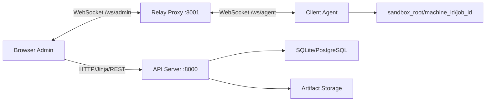

# Architecture

Responsibilities:

- API: authentication, admin pages, REST endpoints, DB, artifacts, audit.
- Relay: WebSocket auth, registry, controller lock, frame/command forwarding.
- Agent: consent banner, fake/real mode, sandbox, screen frames, commands.

